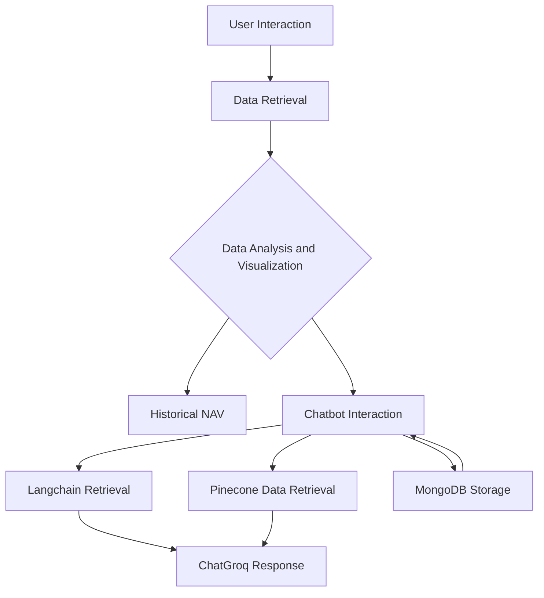

# Mutual Fund Advisory Chatbot Application

**Developers**: Amitesh Patra, Jainil Patel  
**GitHub Repository**: [Link to Repository](https://github.com/amitesh30/AIBF-MUTUAL-FUND-RAG-LLM/)

## Objective
An interactive chatbot providing mutual fund advice with real-time data, personalized responses, and visualizations.
## Tech stack

  
  
  
  
  
  
  

## Features
- Real-time mutual fund data retrieval using `Mftool`.
- Contextual chatbot responses with `Langchain` and `ChatGroq`.
- Vector storage and retrieval with `Pinecone`.
- Data visualization of NAV history with `Plotly`.
- Chat history stored in `MongoDB`.

## Architecture

